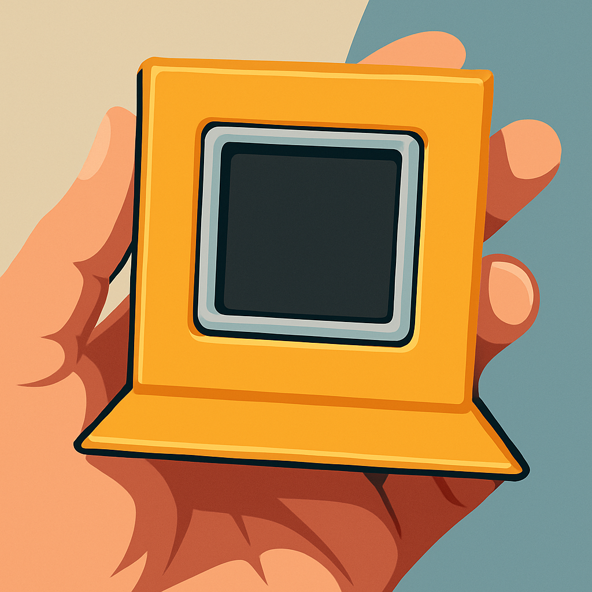

# supr:signal

> **Disclaimer:** This project was created to showcase the author’s personal experiments and ideas.  
> It is shared publicly only to illustrate these explorations, not as production-ready software.  
> Still, it might be useful to others as inspiration or a source of ideas.

supr:signal is a custom firmware for Atom Matrix that allows users to control the LEDs freely — to draw emojis, animate patterns, or display any useful information. It also supports messages and uses the first row as a channel to communicate the device status.

_**If you want to craft supr:signal, a 3D-printable model is available in the assets directory.**_ 

       ● ● ● ● ● 
       ○ ○ ○ ○ ○
       ○ ○ ○ ○ ○
       ○ ○ ○ ○ ○
       ○ ○ ○ ○ ○

       ● (system reserved)
       ○ (user defined) 
---

**Note:** *System reserved* can be used to show information for a short time.  
After that, they are reset and the reserved system bar returns to its normal state.

